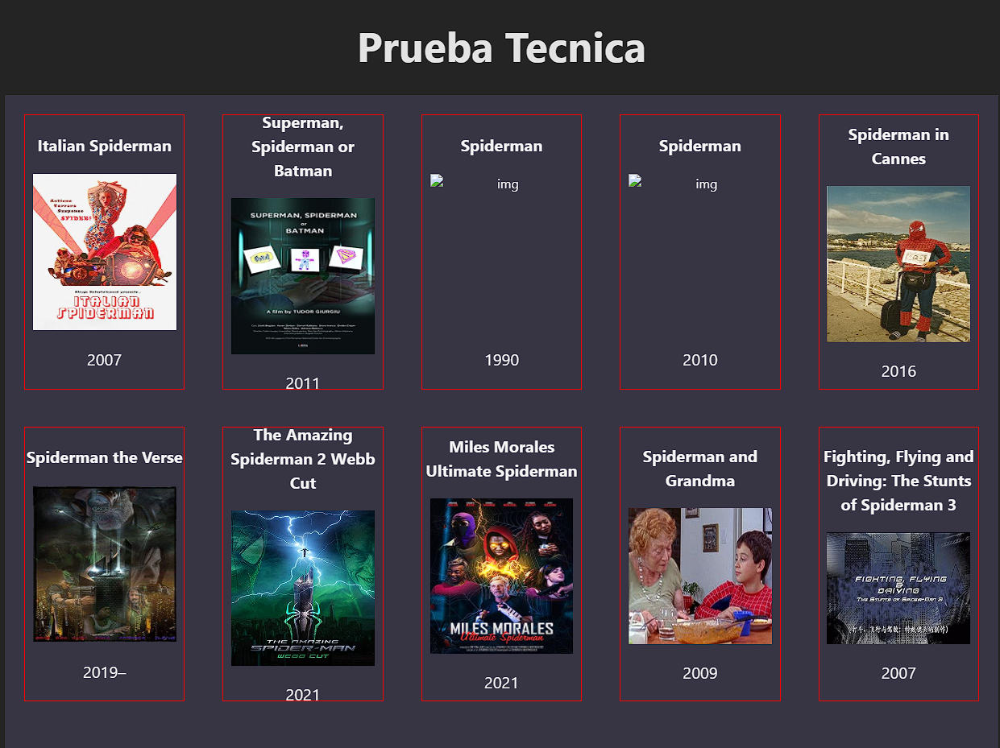

# React + Vite

This template provides a minimal setup to get React working in Vite with HMR and some ESLint rules.

Currently, two official plugins are available:

- [@vitejs/plugin-react](https://github.com/vitejs/vite-plugin-react/blob/main/packages/plugin-react/README.md) uses [Babel](https://babeljs.io/) for Fast Refresh
- [@vitejs/plugin-react-swc](https://github.com/vitejs/vite-plugin-react-swc) uses [SWC](https://swc.rs/) for Fast Refresh

En este ejercicio deberiamos poder encontrar los errores que hacen que la aplicacion no funcione.

se deberia realizar una llamada a la API de Omdb 

y renderizar el listado de peliculas. 

tambien se deberia filtrar las peliculas y ordenarlas por año de lanzamiento

deberia renderizar esta imagen en pantalla
